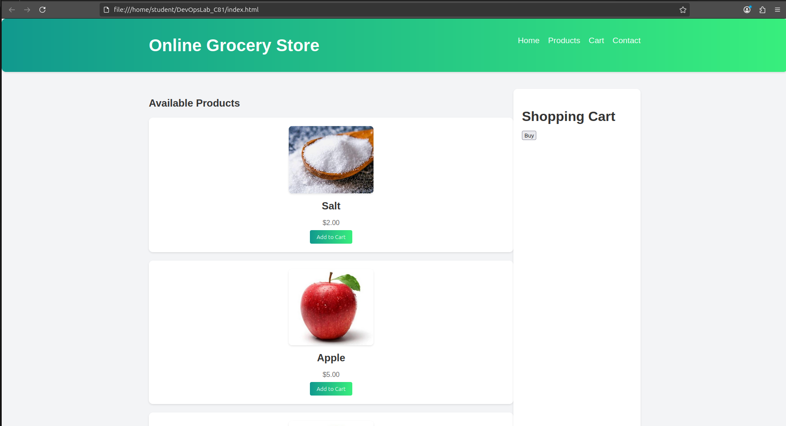
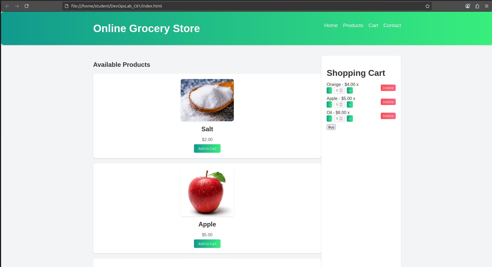
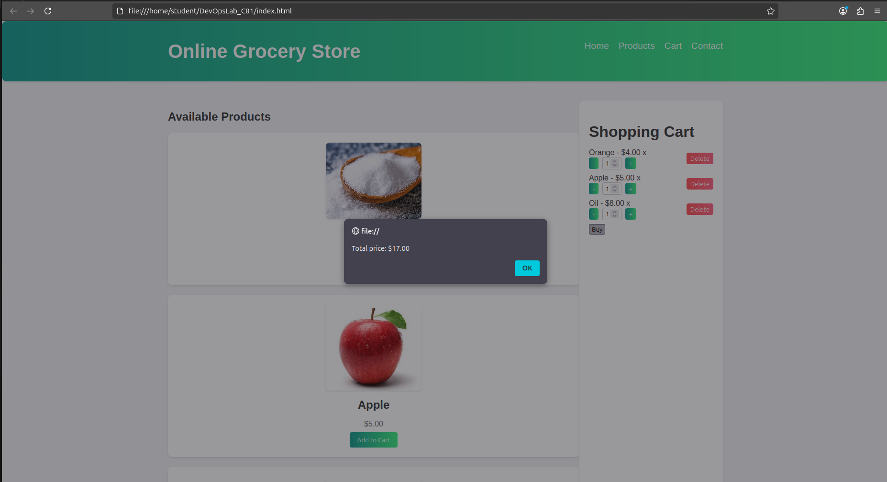

# Online Grocery Store Web Application

An interactive e-commerce web application built for **DevOps Lab Experiment No. 3** to demonstrate source code management and Git version control workflows.

---

## 🚀 Features
- **Product Catalog:** View available grocery items with prices and images.
- **Dynamic Shopping Cart:** Add items, adjust item quantities (+ / -), or delete items.
- **Checkout Calculation:** Calculates total bill amount dynamically upon checkout.

---

## 🛠️ Tech Stack
- **HTML5** - Page structure & layout
- **CSS3** - Responsive styling & UI elements
- **JavaScript (Vanilla)** - Cart state management & DOM updates

---

## 📸 Screenshots

### 1. Home Page & Product Listing


### 2. Adding Items to Cart


### 3. Checkout Total Calculation


---

## 💻 How to Run Locally

1. Clone the repository[cite: 1]:
   ```bash
   git clone [https://github.com/poonamnelure/online-grocery-website.git](https://github.com/poonamnelure/online-grocery-website.git)
